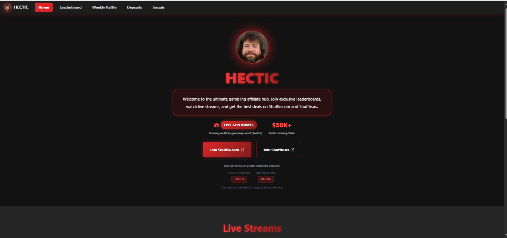
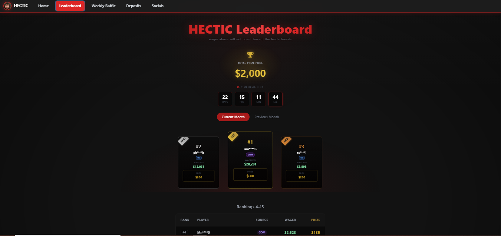
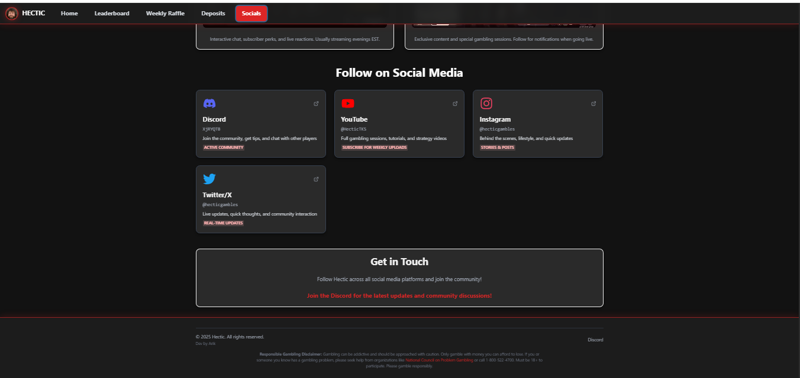
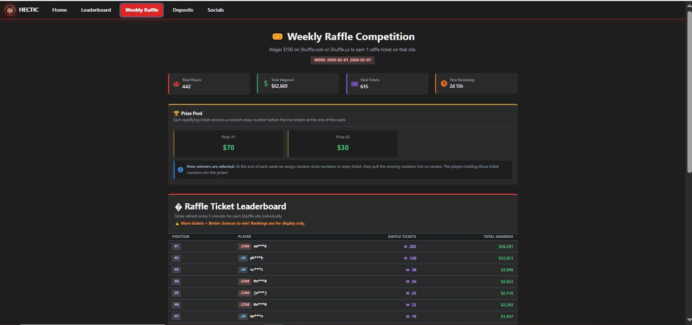

# Hectic - Affiliate Gaming Hub (Showcase)

🚀 **Production-ready Affiliate Platform for Gaming Community**

This repository is a public showcase of a real-world affiliate system featuring dual-site leaderboards, weekly raffle ticket generation, prize management, and Shuffle.com/us API integration.

⚠️ **This is a showcase repository only. Source code and backend logic are proprietary and intentionally not included.**

---

## 🌐 Live Website

👉 **Live Site**: [https://www.hecticgambles.com/](https://www.hecticgambles.com/)

⚠️ Public access available. Admin features require authentication.

---

## 📌 About This Repository

This repository is **NOT open-source**.

It exists only to:
- Showcase system features and workflows
- Demonstrate real-world affiliate integration
- Provide a live demo for evaluation
- Share high-level architecture

🚫 **Source code is not included**  
🚫 **Backend services are private**  
🚫 **Rebuilding or deploying is not permitted**

---

## ✨ Key Features (High-Level)

### Dual-Site Leaderboards
- Toggle between Shuffle.com and Shuffle.us
- Real-time data synchronization
- Username masking for public display (e.g., `us****e`)
- Unmasked admin view for prize distribution

### Shuffle Affiliate API Integration
- Shuffle Affiliate API V1.1 compliance
- Automated data polling (20-second intervals)
- Rate limiting compliance (1 request per 10 seconds)
- Current month and historical leaderboard data
- Finalized bets only tracking

### Weekly Raffle System
- **Fisher-Yates Shuffle**: Random ticket distribution
- **Ticket Generation**: Automated ticket assignment based on wagers
- **Downloadable Files**: Masked (public) and unmasked (internal) formats
- **Duplicate Prevention**: Database-level protection
- **Professional Formatting**: 20-char usernames, 12 tickets per row

### Prize Management System
- Editable prize structures through admin panel
- Monthly prize pools (8 prize tiers)
- Default prizes: $300 (1st) down to $25 (8th)
- Admin-only access with JWT protection

### Admin Dashboard
- JWT authentication
- Full leaderboard access (unmasked usernames)
- Prize structure editor
- Raffle ticket generation interface
- Archive management

### Responsive Design
- Dark theme (red and grey color scheme)
- Mobile and desktop optimized
- Inspired by CamNeverWins aesthetic
- Smooth animations with Framer Motion

### Social Integration
- Embedded Twitch/Kick streams
- Social media grid (Discord, YouTube, TikTok, Instagram, Twitter/X)
- Affiliate referral links (Shuffle.com/us, NordVPN)

### Deposit Guides
- Step-by-step instructions
- Affiliate links for Shuffle.com and Shuffle.us
- VPN recommendations (NordVPN affiliate)

---

## 🏗️ System Architecture (High-Level Overview)

### Frontend
- **Framework**: React 18
- **UI Library**: Chakra UI (custom red/grey theme)
- **Build Tool**: Vite
- **Routing**: React Router DOM
- **HTTP**: Axios
- **Animations**: Framer Motion
- **Icons**: React Icons

### Backend
- **Runtime**: Node.js + Express
- **Database**: MongoDB Atlas (cloud)
- **ORM**: Mongoose
- **Authentication**: JWT
- **Password**: bcryptjs
- **Scheduling**: Node-cron (20-second polling)
- **API**: Shuffle Affiliate API V1.1

### Infrastructure
- **Process Manager**: PM2
- **Reverse Proxy**: Nginx (with rate limiting)
- **Environment**: Production-ready configuration

### External Integrations
- **Shuffle.com API**: Affiliate leaderboard data
- **Shuffle.us API**: US-specific leaderboard data
- **NordVPN**: Affiliate program integration

**Full system design and backend logic are intentionally private.**

---

## 🎮 Notable Features

### Fisher-Yates Shuffle Algorithm
Cryptographically secure random ticket distribution for weekly raffles.

### Username Masking
- **Public**: First 2 chars + `****` + last char
- **Examples**: `username` → `us****e`, `hectic` → `he****c`
- **Admin**: Full unmasked usernames for prize distribution

### Shuffle API Rate Limiting
- Enforces 1 request per 10 seconds
- Token bucket implementation
- Handles `TOO_MANY_REQUEST` errors gracefully

### Automated Cron Jobs
- **Leaderboard Polling**: Every 20 seconds for current month
- **Historical Data**: Every 3 hours for previous month
- **Ticket Archival**: Automated weekly raffle finalization

### Ticket File Formatting
- Username padding: 20 characters (right-aligned)
- Ticket numbers: 12 per row
- Header with week info and prize breakdown
- Downloadable as `.txt` files

---

## 🖼️ Screenshots

- Homepage with hero section
- 
- Leaderboard (Shuffle.com/us toggle)
- 
- Deposit guide page
- 
- Socials page with streams
- 
- Admin dashboard
- 

---

## 🔐 License & Usage

**Proprietary Software – All Rights Reserved**

This repository and the showcased system are the intellectual property of **Parikshit Gorain**.

### ❌ You may NOT:
- Copy or reproduce the source code
- Rebuild or redeploy the system
- Create derivative works
- Use commercially or non-commercially without permission

### ✅ You MAY:
- View the live demo
- Review this documentation
- Request authorized usage or collaboration

📩 **For licensing, collaboration, or authorized deployment:**  
Email: [parikshitgorain@yahoo.com](mailto:parikshitgorain@yahoo.com)

---

## 👤 Ownership

**Owner & Maintainer**: Parikshit Gorain  
**Contact**: parikshitgorain@yahoo.com

Unauthorized copying, redistribution, or misuse is strictly prohibited.

---

## 🤖 Building with AI

This system is built and improved using **AI-assisted workflows**, automation, and monitoring tools.

**AI Contribution**: Development process leveraged AI for:
- React component generation
- Chakra UI theme customization
- API integration patterns
- Shuffle API compliance implementation
- Security best practices
- Documentation

All AI-generated code was reviewed, tested, and integrated by the developer.

**Development is ongoing with continuous improvements.**

---

## 💡 Tech Highlights

### Frontend Technologies
- React 18
- Chakra UI (custom theme)
- Vite
- React Router DOM
- Axios
- Framer Motion
- React Icons

### Backend Technologies
- Express.js
- MongoDB Atlas + Mongoose
- JWT (jsonwebtoken)
- bcryptjs
- Node-cron
- Axios (Shuffle API client)

### Security Features
- JWT authentication
- bcrypt password hashing
- CORS configuration
- Rate limiting (Nginx + Node.js)
- Username masking for privacy
- Admin-only endpoints

### API Integration
- Shuffle Affiliate API V1.1
- Rate limit compliance (1 req / 10 sec)
- Error handling (TOO_MANY_REQUEST, REFEREES_NOT_FOUND)
- Automated retry logic

---

## 📊 System Stats

- **Leaderboards**: Dual-site (Shuffle.com + Shuffle.us)
- **Polling**: 20-second intervals for live data
- **Raffles**: Weekly automated ticket generation
- **Prizes**: 8-tier monthly prize structure
- **Uptime**: Production-ready with PM2
- **Security**: JWT, rate limiting, username masking

---

## 🌟 About This Project

This affiliate platform was built by **Parikshit Gorain** as a custom solution for a gaming community client.

**Key Development Challenges Solved:**
1. **Shuffle API Integration**: Implemented compliant real-time leaderboard sync with rate limiting
2. **Fair Raffle System**: Developed Fisher-Yates shuffle algorithm for transparent ticket distribution
3. **Performance**: Optimized 20-second polling without overwhelming the API
4. **Admin Tools**: Built comprehensive dashboard for prize and raffle management
5. **Privacy**: Implemented username masking for public leaderboards

This project demonstrates full-stack development capabilities with external API integration, real-time data synchronization, and production-ready deployment.

---

## ⚠️ Responsible Gambling

This platform promotes **responsible gambling practices**. Users should always:
- Gamble within their means
- Never chase losses
- Seek help if gambling becomes problematic

**Resources**:
- [National Council on Problem Gambling](https://www.ncpgambling.org/)
- [Gamblers Anonymous](https://www.gamblersanonymous.org/)

---

## 📞 Developer Contact

**Live Demo**: [https://www.hecticgambles.com/](https://www.hecticgambles.com/)

**Contact**:
- **Email**: parikshitgorain@yahoo.com

---

## 📄 License

**Proprietary License** - All rights reserved.

See contact information above for licensing inquiries.

---

**Built with ❤️ by Parikshit Gorain with AI assistance**

*Last Updated: February 2026*
